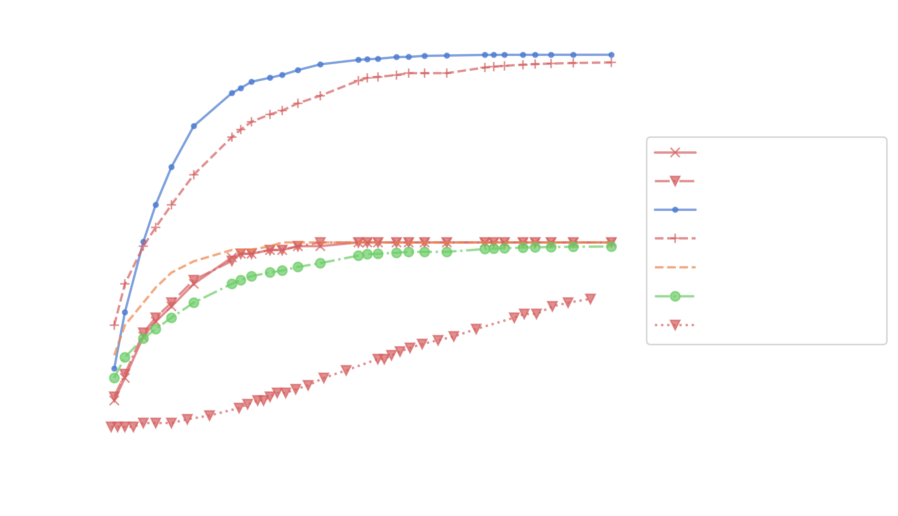

# prettypercentiles

Python utility for pretty percentile plots. Ideal for plotting latency graphs from csv files.

## Usage

Install Python 3 (Tested so far with 3.9)

(Optional but recommended to prevent cluttering your global pip) create a virtual environment in this directory:

```
python -m venv .venv
```

Activate the virtual environment:

```
.venv\Scripts\activate
```

Install dependencies from `requirements.txt`:

```
pip install -r requirements.txt
```

Run plotter:

```
python prettypercentiles.py -c configs.example_config
```

## Configuration

Configuration files are located in `configs/`

The configuration file is just a Python file with variables. If you want to make your own copy the `example_config.py` to a new file in the same folder.

There are comments for each setting, the most important ones are these:

### `tuple` of `(csv filename, column name, preprocessing function)`

These define where and which column to get and an optional preprocessing function to run it through

### `label_map`

A dict which maps the above columns to labels in your plot. The key is the label in the plot and the value is the [tuple](<#`tuple`-of-`(csv-filename,-column-name,-preprocessing-function)`>)

### `combined_columns`

A dict that combine several columns into one using a given function. The key is the label in the plot and the value is a list of 2 or more [tuples](<#`tuple`-of-`(csv-filename,-column-name,-preprocessing-function)`>)

### `num_intervals`

Number that determines how far into the nines you want to plot.
For example: 3 means you will plot the following intervals:

`[0-90, 90-99, 99-99.9]`

So the higher the number, the closer to 100% you will plot.

### `font_scale`

Float that increases/decreases font size. 1.0 is normal size. For example presentations usually have higher font size compared to papers.

## Output

Running example config:

```
python prettypercentiles.py -c configs.example_config
```

the above command results in the following image in `images/example_plot.png`:


Dark mode config (white text and grid lines):

```
python prettypercentiles.py -c configs.example_config_dark
```

output image in `images/example_plot_dark.png`:


